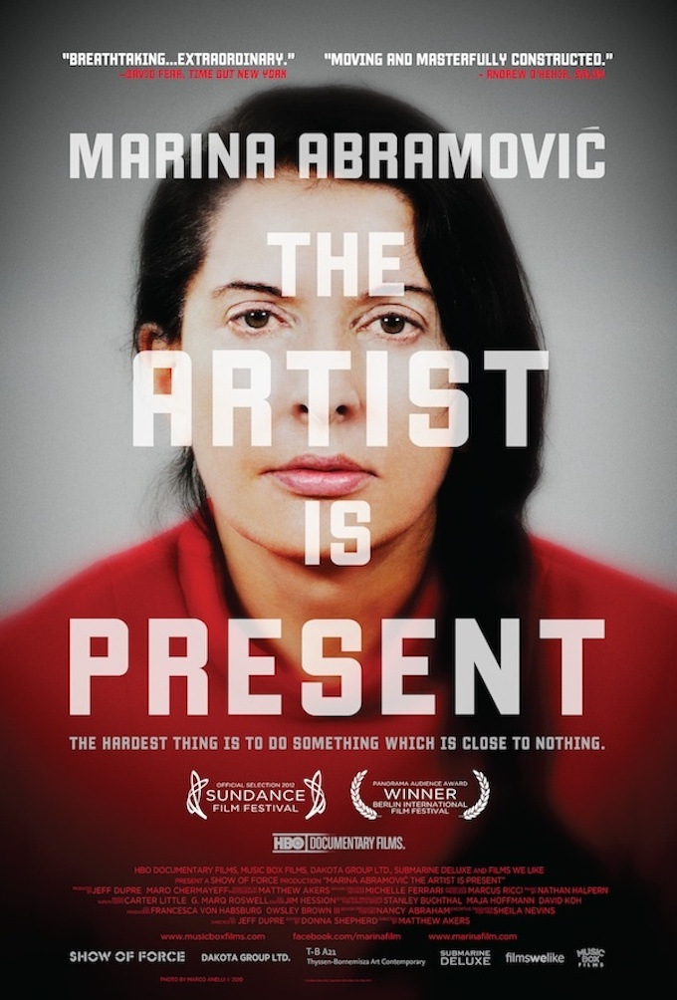
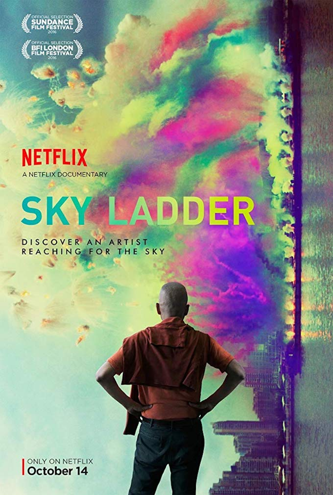
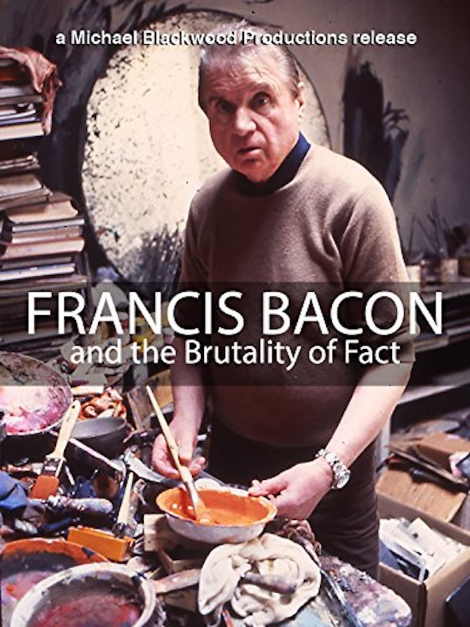
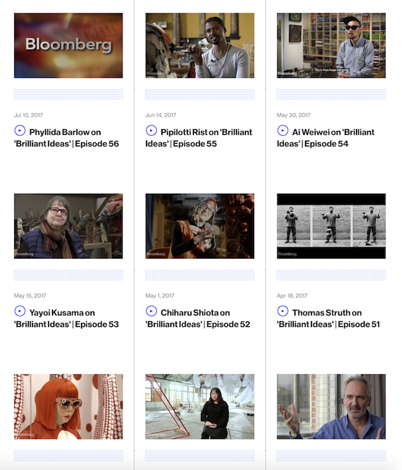
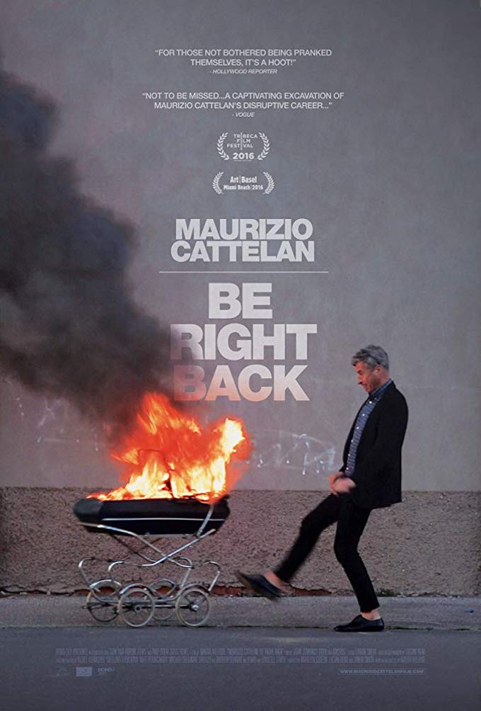
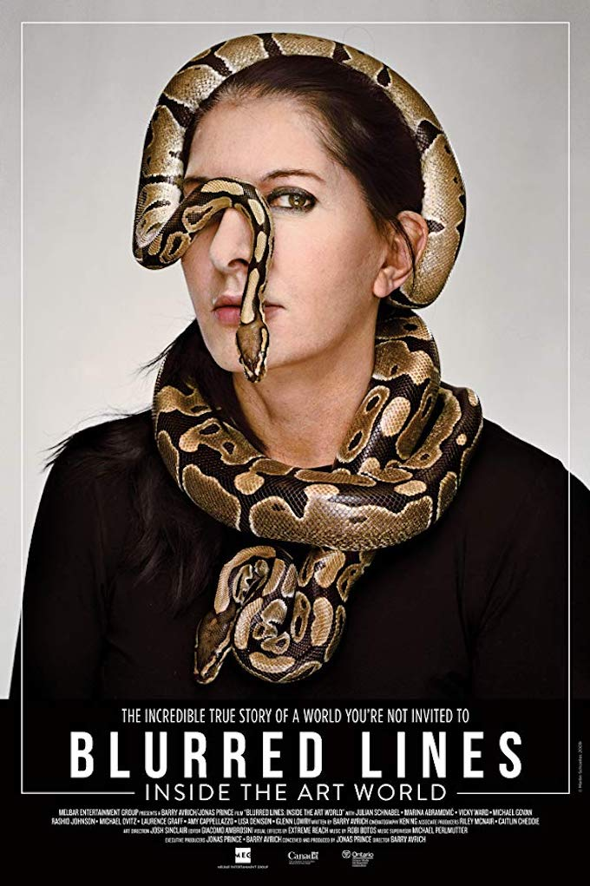
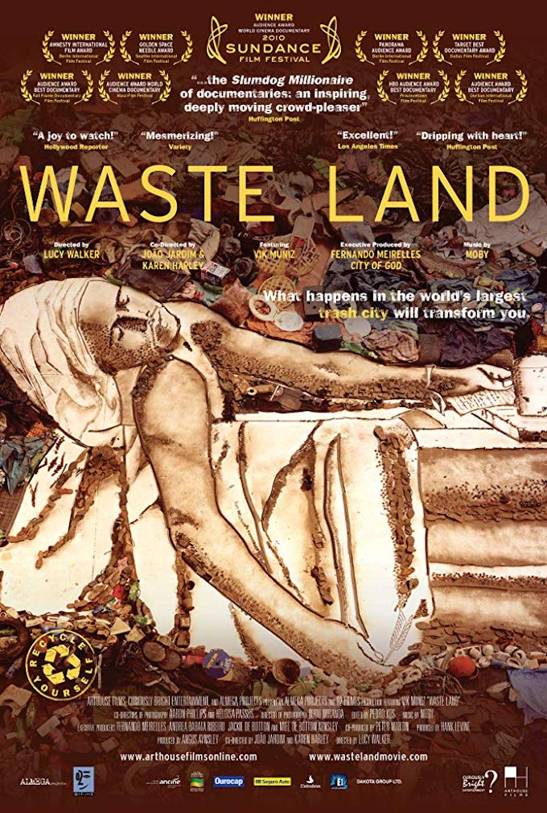
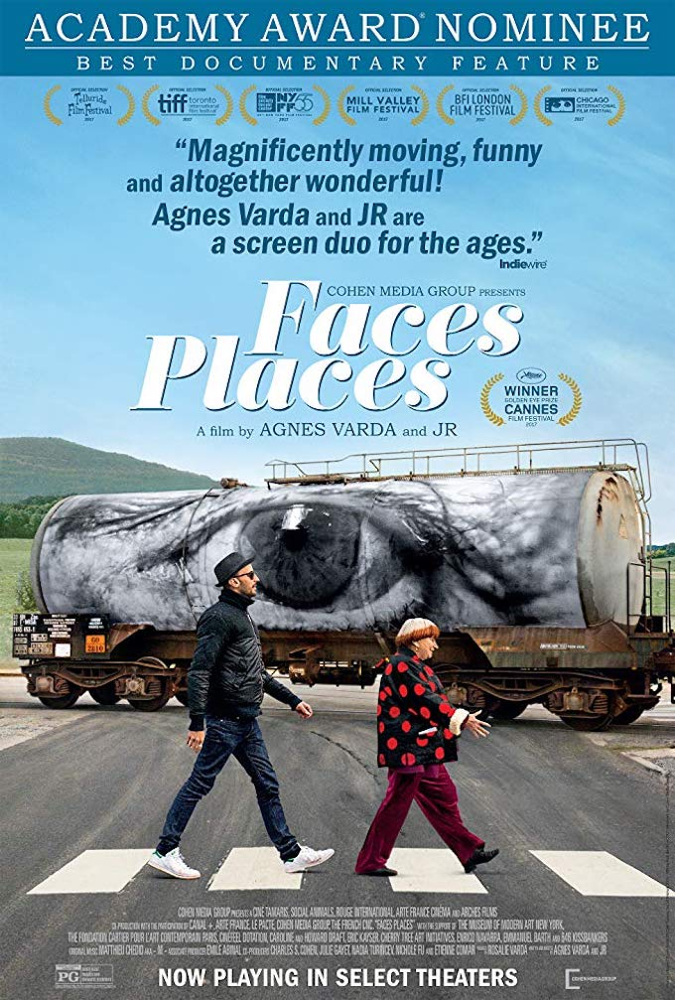

# A Selection of Art Documentaries

The  following article provides a list of selected documentaries about the contemporary art scene, and its importance in shaping society, culture, politics, and economy. Eye-opening and rich content for contemplation and critical reflection.

---

## Ai Weiwei - Never Sorry (2012)
[IMDB link](https://www.imdb.com/title/tt1845773/)

This documentary illustrates the life and work of artist and activist Ai Weiwei, focusing on his clashes with the Chinese government as he demands for social justice and transparency. A retrospective of Weiwei's work is presented, and how his ideas have been shaped by his need for social activism and change. The works that are highly provocative, have attracted a lot of international attention, making Weiwei a leading artist in contemporary art.

---

## Marina Abramovic - The Artist is Present (2012)
[IMDB link](https://www.imdb.com/title/tt2073029/)

Marina Abramovic is regarded as one of the most important artists of the last half of the century, redefining and pushing the boundaries of what art is. Her works are highly provocative and moving, as she puts her physical and mental states at risk. The documentary mainly focus on her Museum of Modern Art exhibition in 2010 - The Artist is Present - and how her previous work and life have led to this iconic performance.

---

## Sky Ladder: The Art of Cai Guo-Qiang (2016)
[IMDB link](https://www.imdb.com/title/tt5278930/), [Netflix](https://www.netflix.com/title/80097472)

This film captures the work and life of Cai Guo-Qiang, whose frequent use of gunpowder serves as both an ancestral homage and an acknowledgement of humanity's fleeting nature. Creating ambitious signature pieces on the largest imaginable scales, Cai's electrifying work often transcends physical permanence all while burning its philosophies into the audience's mind forever. Told through the artist's own words and those of family, friends and vigilant observers, Cai tracks his meteoric rise and examines how and why he engineers artworks that stretch as far as the eye can see and wow millions. (Review from [Rotten Tomatoes](https://www.rottentomatoes.com/m/sky_ladder_the_art_of_cai_guo_qiang_2016))

---

## Francis Bacon and the Brutality of Fact (1987)
[IMDB link](https://www.imdb.com/title/tt1832355/)

A collection of interviews with painter Francis Bacon, discussing in his London studio with David Sylvester about his life, inspirations, and meaning of work. Bacon rationalizes the problems of realism, and explains his obsessive effort to capture and reshape the human form into distorted visual masterpieces.

---

## Brilliant Ideas

[Bloomberg](https://www.bloomberg.com/series/brilliant-ideas)

Brilliant Ideas is a documentary TV series on the world’s most exciting art personalities, produced by MAKE Productions (London/Singapore) and funded by Hyundai. The series is available on Bloomberg TV and profiles a living contemporary artist in each half hour episode, with 75 episodes in total. The documentary is shot in multiple locations around the world to explore the true impact of their stories within the geographical, cultural, and historical context.

---

## Maurizio Cattelan - Be Right Back (2016)

The film documents Maurizio from his early days to the recent Guggenheim retrospective with a few twists along the way. The film captures his heretical installation of a meteorite hitting the Pope and outlandish stunt of duct taping his gallerist to the wall until he faints. His place in the art world is solidified when he lands a major retrospective at the Guggenheim in 2011. (Review from [Rotten Tomatoes](https://www.rottentomatoes.com/m/maurizio_cattelan_be_right_back))

[IMDB link](https://www.imdb.com/title/tt5509780), [Amazon](https://www.amazon.com/Maurizio-Cattelan-Be-Right-Back/dp/B074MG3VRT/)

---

## Blurred Lines: Inside the Art World (2017)
[IMDB link](https://www.imdb.com/title/tt5602204/), [Netflix](https://www.netflix.com/watch/80190585)

This eye-opening documentary peels back the layers of the art world economy- from production to circulation, and delineates every integral player in the game of art-making, including curators, gallerists, collectors, donors, auction houses, and … artists. Featuring extraordinary access to industry players and candid statements from prominent artists like Damien Hirst, Julian Schnabel, Taryn Simon, and Marina Abramovic, Blurred Lines collides the two narratives of the art world as both above and beholden to market forces. (Review from [Tribecafilm](https://www.tribecafilm.com/filmguide/blurred-lines-inside-the-art-world-2017))

---

## Waste Land (2016)
[IMDB link](https://www.imdb.com/title/tt1268204/)

Filmed over nearly three years, WASTE LAND follows renowned artist Vik Muniz as he journeys from his home base in Brooklyn to his native Brazil and the world's largest garbage dump, Jardim Gramacho, located on the outskirts of Rio de Janeiro. There he photographs an eclectic band of "catadores" -- or self-designated pickers of recyclable materials. Muniz's initial objective was to "paint" the catadores with garbage. However, his collaboration with these inspiring characters as they recreate photographic images of themselves out of garbage reveals both dignity and despair as the catadores begin to re-imagine their lives. (Review from [Rotten Tomatoes](https://www.rottentomatoes.com/m/waste_land))

---

## Faces Places
[IMDB link](https://www.imdb.com/title/tt5598102/)

Agnès Varda and JR have in common a great passion for and the exploration of images and more precisely, for places and for ways of showing, sharing, and exhibiting them. The two artists set out in JR’s photo booth-enhanced truck, exploring the villages and small towns of rural France and meeting its humble residents – all the while creating large-scale portraits plastered across unconventional locations.

---

**Contemporary Art**

Turning the Art World Inside Out (BBC)
https://www.youtube.com/watch?v=98RUUhVgLR0

Peggy Guggenheim - Art Addict
https://www.youtube.com/watch?v=23nFbGe-txw

Rules of Abstraction (BBC)
https://www.youtube.com/watch?v=Bg3oQ_OqQ_o

Matthew Collings - This is Modern Art
https://www.youtube.com/watch?list=PLCCFD7449BEF13A87&time_continue=169&v=yoSjRRv6ZrE

Exhaustive list of art videos and documentaries: https://www.reddit.com/r/artdocumentaries/

---

**Digital Media**

A Brief History of Computer Animation
https://www.youtube.com/watch?v=w1kRcfs1GNs

Atari: Game Over
https://www.youtube.com/watch?v=y71u6ecF4cI

Synthesis: Processing and Collaboration
https://www.youtube.com/watch?v=KZ08bce18gk

---

**Design**
Escher
https://escher.ntr.nl/en/

---

**Films (Artists' Biographies)**

Pollock (2000) (https://www.imdb.com/title/tt0183659/)

Frida (2002) (https://www.imdb.com/title/tt0120679/)

Basquiat (1996) (https://www.imdb.com/title/tt0115632/)

Modigliani (2004) (https://www.imdb.com/title/tt0367188)
